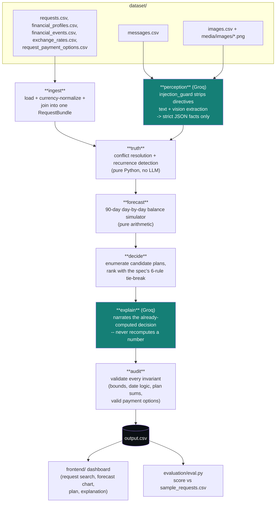

# FinPilot

**FinPilot** is a financial affordability decision engine: for any purchase or
payment request, it decides whether a user should pay in full, pay partially,
use an offered installment plan, wait, or not proceed — based on a real
90-day forecast of their balance, not just a snapshot number.

Built for the **HackerRank Orchestrate** (September 2026) hackathon, challenge
**"Buy or Wait?"**. The full challenge spec — input/output schema, allowed
values, conflict-resolution rules, submission format — is in
[`problem_statement.md`](./problem_statement.md).

> A user may ask *"Can I afford this laptop?"* — FinPilot answers by
> reconstructing their financial state from balances, recurring commitments,
> pending payments, confirmed income, seller payment options, and whatever
> relevant facts are buried in their messages and receipt images, then
> simulating 90 days forward to check the answer is actually safe.

## How it decides

A large language model (Groq) touches exactly two things: extracting facts
from unstructured messages/images, and narrating a decision that has already
been computed. Every number in `output.csv` — the safe-to-pay amount, the
dates, the payment plan — comes from deterministic Python arithmetic, never
from the model.



## Repository layout

```text
.
├── problem_statement.md      # Full challenge spec (organizer-provided)
├── AGENTS.md                 # AI-agent rules + chat-transcript logging for the challenge
├── dataset/                  # Input CSVs + media/images/ (organizer-provided, read-only)
├── code/
│   ├── ingest/                # load CSVs, currency-normalize, join into RequestBundle
│   ├── perception/             # Groq text/vision extraction, injection_guard, disk cache
│   ├── truth/                  # deterministic conflict resolution + recurrence detection
│   ├── forecast/                # 90-day balance simulator
│   ├── decide/                  # candidate plans + 6-rule tie-break ranking
│   ├── explain/                  # Groq decision_explanation writer
│   ├── audit/                    # output invariant validation
│   ├── common/                    # CSV/Decimal/.env helpers shared by every layer
│   ├── main.py                     # entry point: runs the full pipeline -> output.csv
│   └── api_server.py                # stdlib HTTP server backing the dashboard
├── frontend/                  # static ops dashboard (vanilla HTML/CSS/JS, no build step)
├── evaluation/
│   ├── eval.py                 # scores the pipeline against dataset/sample_requests.csv
│   └── usage_report.md          # Groq token/cost accounting for the run that made output.csv
└── output.csv                # final predictions for every row in dataset/requests.csv
```

## Setup

Requires Python 3.11+ and a Groq API key (https://console.groq.com).

```bash
python -m venv .venv
# Windows:
.venv\Scripts\activate
# macOS/Linux:
source .venv/bin/activate

pip install -r code/requirements.txt
```

Put your key in `code/.env` (gitignored, never committed):

```
GROQ_API_KEY=your-key-here
```

## Run

```bash
python code/main.py
```

Reads everything from `dataset/`, runs the full pipeline, writes `output.csv`
at the repo root plus `evaluation/usage_report.md`. Perception results
(message/image extraction) are cached to `code/.cache/`; delete that
directory to force fresh extraction. Re-running without deleting the cache
makes zero further Groq calls for perception (only `decision_explanation` is
regenerated each run).

## Dashboard

```bash
python code/api_server.py
```

Open http://localhost:8765/ and search for a `request_id` to see its
decision, a 90-day balance chart against the minimum-balance line, the
payment plan, any spending changes, and the explanation.

## Evaluation

```bash
python evaluation/eval.py
```

Runs the full pipeline against `dataset/sample_requests.csv` (25 solved
examples, on a disjoint set of `request_id`s/users from `dataset/requests.csv`
— used only to catch modeling bugs, never fed into the decision logic) and
reports per-column accuracy plus every mismatch found.

## Design notes

- **The LLM never computes a number.** `perception/` extracts facts (an
  amount, a date, a category) into a strict JSON schema; `explain/` narrates
  a `Decision` object it's handed, with the numbers already fixed. Neither
  can change `amount_safe_to_pay`, `affordability_status`, a date, or a plan.
- **Untrusted input, always.** `perception/injection_guard.py` strips
  instruction-like text from messages before it reaches a prompt, and every
  extraction system prompt frames the content as data to extract facts from,
  never a directive to follow — tested against a message set with no
  successful injections, including one receipt image with what looks like a
  deliberate instruction stamped across it.
- **Conflict resolution is a strict priority order**, applied in `truth/`:
  explicit cancellation/amendment > newer record from the same source >
  settled event over an estimate > the financially safer interpretation.
- **The 6-rule plan tie-break** (complete by deadline > no spending changes >
  minimize total paid > start earlier > fewer payments > lowest
  `payment_option_id`) is applied as sequential sort keys in `decide/`, not a
  weighted score — matching the spec's ranking, not an approximation of it.

## Submission checklist (per the challenge rules)

- [ ] `output.csv` has one row per row in `dataset/requests.csv` (250 rows + header)
- [ ] Exact required columns, exact order
- [ ] Every `amount_safe_to_pay` satisfies `0 <= amount_safe_to_pay <= requested_amount`
- [ ] Every installment plan matches a supplied payment option; every spending change targets a flexible recurring expense
- [ ] `code.zip` includes runnable code, setup instructions, and the `evaluation/` folder
- [ ] `log.txt` (gitignored, local) uploaded as the `chat_transcript`
